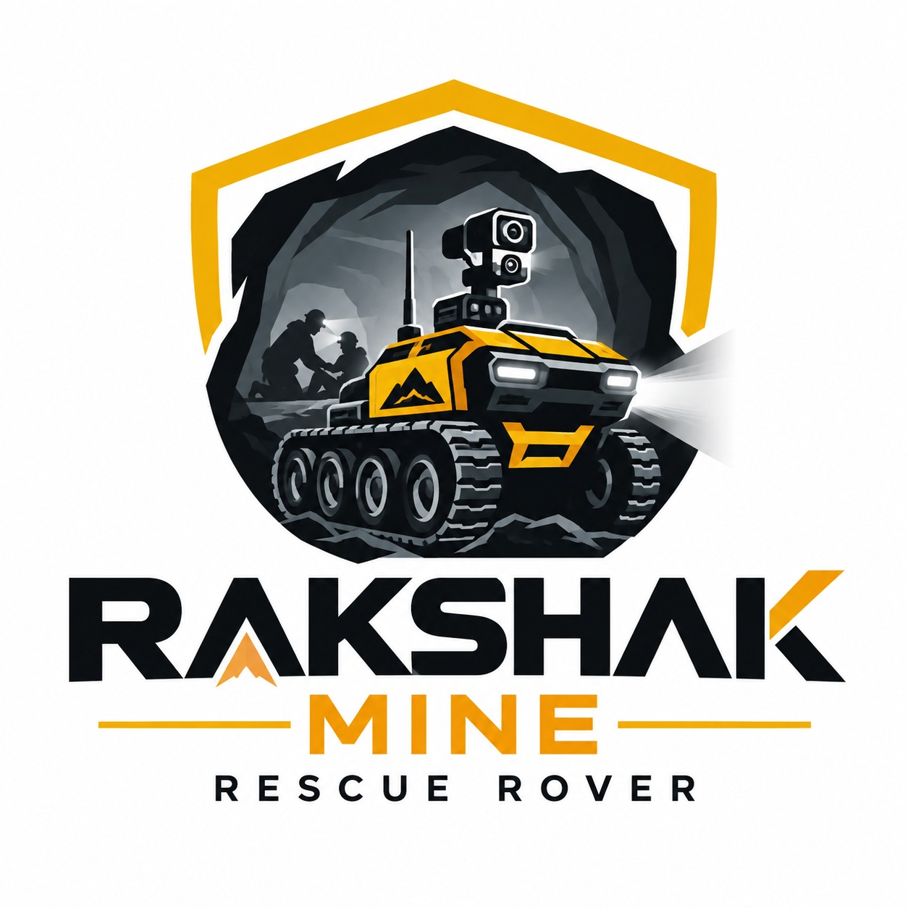
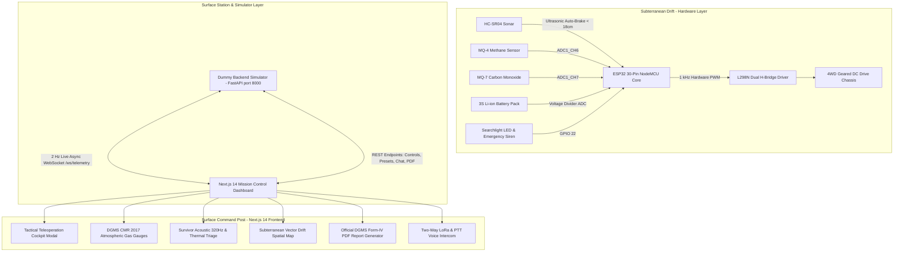

<div align="center">



# 🛡️ PROJECT RAKSHAK-MINE
### Autonomous Robotic Search, Rescue & Underground Mine Safety Monitoring System
**Smart India Hackathon (SIH 2026) | Problem Statement: AI Hazard Detection & Robotics in Underground Mines**

[](https://github.com/Richardfeynman-21/SIX_Wonders)
[](https://nextjs.org/)
[](https://www.espressif.com/)
[](https://fastapi.tiangolo.com/)
[](https://www.dgms.gov.in/)
[](https://www.typescriptlang.org/)
[](https://tailwindcss.com/)

<p align="center">
  <em>"Protection, Detection, and Rescue for Safer Mines and Stronger Lives."</em>
</p>

[Mission Overview](#-mission-overview) •
[System Architecture](#-system-architecture) •
[Repository Structure](#-repository-structure) •
[How the Simulator Works](#-how-the-dummy-backend-simulator-works) •
[Complete API Endpoint Catalog](#-complete-api-endpoint-catalog) •
[Hardware & Wiring](#-hardware-wiring--pin-allocations) •
[ESP32 Firmware](#-esp32-rover-firmware) •
[Frontend Dashboard](#-nextjs-mission-control-dashboard) •
[Getting Started](#-getting-started) •
[DGMS Compliance](#-statutory-dgms-cmr-2017-compliance)

---
</div>

## 📌 Mission Overview

Underground coal mines in the Jharkhand coalfield belt (Jharia, Raniganj, Dhanbad, Bokaro) are among the most hazardous industrial environments in the world. Mineworkers face extreme subterranean perils:
1. **Inflammable & Toxic Gas Outbursts**: Accumulation of methane ($CH_4$ / firedamp) and lethal carbon monoxide ($CO$ / afterdamp) following spontaneous coal seam combustion.
2. **Strata Geotechnical Instabilities**: Roof falls, sidewall spalling, and coal burst shockwaves.
3. **Severe Inundation & Aquifer Breaches**: Sudden water buildup sealing off drift escape routes.
4. **Zero-Visibility Darkness & Airborne Particulate**: Dense coal dust and smoke rendering optical navigation impossible.
5. **Trapped Survivor Localization**: Inability of surface command posts to locate or communicate with survivors through collapsed galleries without risking rescue personnel.

**RAKSHAK-MINE** is an autonomous rescue rover and real-time surface mission control system created by **Team SIX Wonders**. It enables surface operators to remotely explore hazardous drifts, gauge atmospheric toxins, detect acoustic tapping and thermal biometric signatures of trapped survivors, map subterranean obstacles, and coordinate rescue efforts with zero human risk.

---

## 🏗️ System Architecture



---

## 📁 Repository Structure

```
SIX_Wonders/
├── docs/                                  # Project media & documentation assets
│   └── logo.jpg                           # Official Team SIX Wonders emblem
│
├── esp32_rover_firmware/                  # Complete ESP32 Rover Firmware
│   ├── esp32_rover_firmware.ino           # Main C++ firmware (motor PWM, sensors, failsafes)
│   ├── dashboard_html.h                   # Embedded standalone HTML5/WebSocket tactical HUD
│   ├── logo.jpg                           # Embedded logo asset for standalone webserver
│   ├── logo_base64.txt                    # Base64 pre-encoded string of rover emblem
│   └── README.md                          # Firmware flashing & hardware calibration guide
│
├── frontend/                              # Next.js 14 Surface Mission Control Dashboard
│   ├── public/                            # Static assets (rover photos, maps, icons)
│   │   ├── assets/                        # High-resolution graphics & UI mockups
│   │   ├── favicon.ico
│   │   ├── icon.svg
│   │   └── logo.svg
│   ├── src/
│   │   ├── app/
│   │   │   ├── globals.css                # Custom glassmorphism, scrollbars & MG classes
│   │   │   ├── layout.tsx                 # Root HTML layout and metadata
│   │   │   └── page.tsx                   # Central Dashboard with Breadcrumb Subsystems
│   │   ├── components/
│   │   │   ├── GasMonitoringGauges.tsx    # DGMS CMR 2017 gas concentration dials
│   │   │   ├── HazardAndTriage.tsx        # YOLOv8 Geotechnical & survivor triage cards
│   │   │   ├── Header.tsx                 # Online telemetry badges, E-Stop & Bell popover
│   │   │   ├── LiveCameraFeed.tsx         # Optical / thermal viewport with snapshot & teleop
│   │   │   ├── LogsProtocolsReportRow.tsx # Event logs, CMR 2017 protocols & PDF export
│   │   │   ├── MineMapCard.tsx            # Interactive spatial map with waypoint inspection
│   │   │   ├── PowerMonitoringCard.tsx    # 3S Li-ion discharge curve & BMS telemetry
│   │   │   ├── RoverControlModal.tsx      # Tactical teleoperation cockpit with PWM slider
│   │   │   ├── Sidebar.tsx                # 14-item navigation drawer with badge alerts
│   │   │   ├── StatusCardsRow.tsx         # Rover status, battery gauge, connection indicators
│   │   │   ├── SubsystemViews.tsx         # Fullscreen views for all 14 subsystem routes
│   │   │   ├── SurvivorAudioWaveform.tsx  # Web Audio API 320Hz acoustic tapping analyzer
│   │   │   └── TwoWayCommunication.tsx    # Surface-to-rover PTT voice & LoRa intercom
│   │   ├── lib/
│   │   │   ├── api.ts                     # REST client, WebSocket engine & mock data
│   │   │   └── utils.ts                   # Formatting, CSS merging & styling helpers
│   │   └── types/
│   │       ├── rover.ts                   # Hardware & teleoperation TypeScript contracts
│   │       └── telemetry.ts               # Sensor telemetry, alerts & command interfaces
│   ├── package.json                       # Next.js 14, React 18, Lucide React, Tailwind
│   ├── tailwind.config.js                 # Theme colors, borders, custom animations
│   ├── tsconfig.json                      # Strict TypeScript compilation options
│   └── README.md                          # Frontend setup, configuration & architecture
│
├── dummy_backend.py                       # Standalone Python FastAPI Mission Simulator
├── dummy_backend/                         # State & routing modules for simulator
│   ├── __init__.py
│   ├── state.py                           # State store & defaults
│   └── routers/
├── esp32.ino                              # Standalone copy of ESP32 firmware
├── AI_Mine_Safety_Rescue_Rover_Detailed_BOM_Architectures.xlsx # Bill of Materials & Costs
├── SurfaceStationGateway.java             # Standalone Java gateway bridge
├── .gitignore                             # Clean filtering for Node, Python, logs & scripts
└── README.md                              # Master project dossier (this file)
```

---

## 🔬 How the Dummy Backend Simulator Works

The backend (`dummy_backend.py`) is a **standalone, self-contained Python FastAPI server** operating on port `8000`. It emulates the subterranean sensor array, motor drivers, LoRa radio link, and statutory DGMS safety rules without requiring physical hardware.

### 1. The 2 Hz Asynchronous Telemetry Loop
* Runs as a background task via `asyncio.create_task(telemetry_background_worker())`.
* Executes every **500 ms (2 Hz)**, calling `update_telemetry_tick()`.
* Generates realistic continuous telemetry fluctuations using bounded random walks and trigonometric oscillations:
  - **Battery Discharge**: Simulates realistic battery drain based on motor activity (faster drain when moving at sprint speed 255 PWM).
  - **Atmospheric Gases**:
    - **Methane ($CH_4$)**: Safe baseline (~0.42% – 0.82%), with slight natural variations.
    - **Carbon Monoxide ($CO$)**: 22–26 ppm (safe DGMS threshold is < 50 ppm).
    - **Carbon Dioxide ($CO_2$)**: 400–440 ppm.
    - **Oxygen ($O_2$)**: 20.4% – 20.8%.
  - **Subterranean Climate**: Ambient temperature ($21.8^\circ\text{C} – 22.4^\circ\text{C}$), relative humidity (66%–70%), and pressure ($101.0 – 101.4\text{ kPa}$ corresponding to -310m depth).
  - **Biometrics & Survivor Triage**: Human acoustic tapping patterns (320 Hz) and thermal body heat signatures ($36.8^\circ\text{C}$).
* Automatically packages the snapshot and broadcasts it to all connected WebSocket clients on `/ws/telemetry`.

### 2. Anomaly & Disaster Injection Mode (`/api/sim/toggle`)
* Allows operators to test emergency protocols with a single click or API call.
* When **Anomaly Mode** is triggered:
  - Methane spikes to **2.35%** (violating the DGMS Regulation 169 lower explosive limit of 1.25%).
  - Carbon monoxide surges to **68 ppm** (violating the 50 ppm permissible exposure limit).
  - Temperature rises to **$34.5^\circ\text{C}$** and humidity to **83%**.
  - Immediate `CRITICAL` statutory alerts are injected into the FIFO log stream.
  - Compliance state switches from `COMPLIANT` to `NON_COMPLIANT`, triggering visual warning banners on the dashboard.

### 3. DGMS Compliance Rule Engine
* Automatically cross-examines incoming telemetry against statutory Coal Mines Regulations (CMR) 2017 thresholds:
  - **Coal Seam Degree III (Gassy)**: Strict $CH_4 < 0.75\%$ general body limit; automatic cut-off at $1.25\%$.
  - **Standard DGMS Rescue**: Nominal limits for active search operations.
  - **Post-Incident Recovery**: Long-term atmospheric stability margins.

### 4. Automated Intercom ACK Engine (`/api/chat/send`)
* Parses surface operator messages and generates context-aware acoustic replies from the rover:
  - Queries containing `"gas"` or `"report"` return real-time gas metrics.
  - Queries containing `"light"` engage the 1200-lumen Cree searchlight.
  - Queries containing `"siren"` sound the emergency acoustic beacon.
  - Queries containing `"stop"` halt propulsion and activate geophone listening.

### 5. ReportLab Form-IV PDF Generation (`/api/export/pdf`)
* Compiles mission data into an official DGMS Form-IV Incident Briefing Report PDF containing:
  - Mine sector and rover telemetry summary.
  - Atmospheric gas analysis table with CMR 2017 compliance status.
  - Survivor triage log and thermal readings.
  - Chronological event audit log.

---

## 📡 Complete API Endpoint Catalog

All endpoints are hosted at `http://127.0.0.1:8000`.

### 1. Root & Status Endpoints

#### `GET /`
Verifies backend connectivity, version, and operational mode.
* **Request**: None
* **Response (JSON)**:
  ```json
  {
    "rover_id": "RAKSHAK-Mine",
    "status": "ONLINE",
    "system": "RAKSHAK-Mine Autonomous Mine Rescue Rover Simulator",
    "version": "1.0.0",
    "rate": "2 Hz (500ms)",
    "anomaly_mode": false,
    "active_dgms_preset": "COAL_SEAM_DEGREE_III"
  }
  ```

#### `GET /api/status`
Returns the current unified telemetry payload.
* **Request**: None
* **Response (JSON)**:
  ```json
  {
    "rover_id": "RAKSHAK-Mine",
    "system_status": "OPERATIONAL",
    "esp32_online": true,
    "pi_online": true,
    "battery_voltage": 11.85,
    "battery_percent": 78.0,
    "battery_status": "NORMAL",
    "temperature_c": 22.1,
    "humidity_pct": 68.0,
    "pressure_hpa": 101.2,
    "mq135_ppm": 165.0,
    "mq7_ppm": 25.0,
    "gas_ch4": 0.8,
    "gas_co": 25.0,
    "gas_co2": 420.0,
    "gas_o2": 20.6,
    "audio_ambient_db": 42.0,
    "acoustic_tapping_detected": true,
    "obstacle_distance_cm": 120.0,
    "obstacle_detected": false,
    "motor_state": "STOPPED",
    "motor_speed": 200,
    "buzzer_active": false,
    "searchlight_active": true,
    "thermal_hotspots_count": 1,
    "thermal_max_temp_c": 36.8,
    "ai_detected_survivors": 1,
    "survivor_triage_priority": "HIGH",
    "dgms_compliance_status": "COMPLIANT",
    "active_alerts": [
      {
        "id": 1,
        "time": "14:31",
        "timestamp": "2026-09-13T12:00:00.000000",
        "alert_type": "SURVIVOR",
        "message": "Possible human voice detected (RAKSHAK-Mine)",
        "severity": "HIGH",
        "value": 1.0,
        "threshold": 1.0
      }
    ],
    "ch4_pct": 0.8,
    "co_ppm": 25.0,
    "co2_ppm": 420.0,
    "o2_pct": 20.6,
    "pressure_kpa": 101.2,
    "last_update": "12:00:00"
  }
  ```

---

### 2. Teleoperation & Controls

#### `POST /api/rover/control`
Dispatches propulsion commands, speed adjustments, searchlight toggles, or emergency stops.
* **Request Body (JSON)**:
  ```json
  {
    "command": "FORWARD",
    "speed": 220
  }
  ```
  *Supported commands*: `FORWARD`, `BACKWARD`, `LEFT`, `RIGHT`, `STOP`, `E_STOP`, `LIGHT_ON`, `LIGHT_OFF`, `BUZZER_ON`, `BUZZER_OFF`.
* **Response (JSON)**:
  ```json
  {
    "status": "ACK",
    "command": "FORWARD",
    "motor_state": "FORWARD",
    "buzzer_active": false,
    "searchlight_active": true
  }
  ```

---

### 3. DGMS Compliance & Regulatory

#### `POST /api/dgms/preset`
Updates the active Coal Mines Regulations threshold preset.
* **Query Parameter**: `preset` (optional, e.g. `COAL_SEAM_DEGREE_III`, `STANDARD_DGMS`, `POST_INCIDENT_RECOVERY`)
* **Request Body (JSON, alternative)**:
  ```json
  {
    "preset": "COAL_SEAM_DEGREE_III"
  }
  ```
* **Response (JSON)**:
  ```json
  {
    "status": "OK",
    "preset": "COAL_SEAM_DEGREE_III"
  }
  ```

---

### 4. Reporting & Auditing

#### `POST /api/export/pdf`
Generates and downloads the official DGMS Form-IV Incident Briefing Report PDF.
* **Request**: None
* **Response**: Binary stream (`application/pdf`) with `Content-Disposition: attachment; filename="DGMS_Incident_Report_RAKSHAK_Mine.pdf"`.

---

### 5. Historical Data & Alerts

#### `GET /api/alerts`
Returns recent and active incident alerts.
* **Query Parameters**:
  - `limit` (integer, default `20`, min `1`, max `100`): Maximum alerts to return.
* **Response (JSON Array)**:
  ```json
  [
    {
      "id": 1,
      "time": "14:31",
      "timestamp": "2026-09-13T12:00:00.000000",
      "alert_type": "SURVIVOR",
      "message": "Possible human voice detected (RAKSHAK-Mine)",
      "severity": "HIGH",
      "value": 1.0,
      "threshold": 1.0
    }
  ]
  ```

#### `GET /api/telemetry/history`
Returns time-series telemetry snapshots for historical trend charting.
* **Query Parameters**:
  - `limit` (integer, default `60`, min `5`, max `300`): Number of past ticks.
* **Response (JSON Array)**: Array of `RoverCombinedStatus` objects.

---

### 6. Simulation & Testing

#### `POST /api/sim/toggle`
Toggles or sets the anomaly injection mode.
* **Query Parameter**: `enable` (boolean, optional)
* **Request Body (JSON, alternative)**: `{"enable": true}`
* **Response (JSON)**:
  ```json
  {
    "status": "OK",
    "anomaly_mode": true,
    "system_status": "EMERGENCY",
    "dgms_compliance_status": "NON_COMPLIANT"
  }
  ```

---

### 7. Surface-to-Drift Intercom

#### `POST /api/chat/send`
Sends an operator message to the rover over simulated LoRa/acoustic link and receives an automated reply.
* **Request Body (JSON)**:
  ```json
  {
    "message": "Report atmospheric gas levels immediately",
    "recipient": "RAKSHAK-Mine"
  }
  ```
* **Response (JSON)**:
  ```json
  {
    "status": "ACK",
    "rover_id": "RAKSHAK-Mine",
    "recipient": "RAKSHAK-Mine",
    "message": "Report atmospheric gas levels immediately",
    "reply": "RAKSHAK-Mine Status Report: Systems operational at 12:00. CH4: 0.8%, CO: 25.0 ppm. Survivor signature: 36.8°C at Sector B-4.",
    "timestamp": "12:00"
  }
  ```

---

### 8. Real-Time Streaming WebSocket

#### `WS /ws/telemetry`
High-frequency (2 Hz / 500ms) full-duplex WebSocket stream.
* **Server to Client**: Pushes `RoverCombinedStatus` JSON payload every 500ms.
* **Client to Server**: Accepts teleoperation commands in JSON format:
  ```json
  {
    "command": "FORWARD",
    "speed": 220
  }
  ```
  Immediately echoes updated status back upon receipt.

---

## ⚡ Hardware Wiring & Pin Allocations

The rover uses an **ESP32 30-Pin NodeMCU** microcontroller. All pin allocations are strictly defined in [`esp32_rover_firmware/esp32_rover_firmware.ino`](esp32_rover_firmware/esp32_rover_firmware.ino):

| Subsystem | Component | ESP32 Pin | Function / Logic | Hardware Notes |
| :--- | :--- | :--- | :--- | :--- |
| **Motor Drive** | L298N ENA | **GPIO 32** | Right Motors PWM | Jumper removed; 1 kHz PWM frequency |
| **Motor Drive** | L298N IN1 | **GPIO 27** | Right Direction 1 | Standard logic level |
| **Motor Drive** | L298N IN2 | **GPIO 14** | Right Direction 2 | Standard logic level |
| **Motor Drive** | L298N IN3 | **GPIO 25** | Left Direction 1 | Standard logic level |
| **Motor Drive** | L298N IN4 | **GPIO 26** | Left Direction 2 | Standard logic level |
| **Motor Drive** | L298N ENB | **GPIO 33** | Left Motors PWM | Jumper removed; 1 kHz PWM frequency |
| **Sonar Distance**| HC-SR04 TRIG | **GPIO 5** | Sonar Trigger Pulse | 10µs trigger pulse |
| **Sonar Distance**| HC-SR04 ECHO | **GPIO 4** | Sonar Echo Pulse | **Requires 5V to 3.3V divider (1kΩ / 2kΩ)** |
| **Gas Sensing** | MQ-4 (CH4) | **GPIO 34** | Analog Methane Level | ADC1_CH6 (Input-only pin) |
| **Gas Sensing** | MQ-7 (CO) | **GPIO 35** | Analog Carbon Monoxide | ADC1_CH7 (Input-only pin) |
| **Safety Warning**| High-Decibel Siren| **GPIO 22** | Strobe & Acoustic Buzzer | Active High output |

---

## 🤖 ESP32 Rover Firmware

The firmware located in [`esp32_rover_firmware/`](esp32_rover_firmware/) provides autonomous failsafes and real-time teleoperation capabilities:

* **Dual-Bridge L298N Propulsion**: 1 kHz hardware PWM driving 4 geared motors with smooth speed ramp control (100–255 PWM).
* **180° Physical Chassis Inversion**: Inverted chassis logic handles sonar and gas sensor orientation with a software-controllable `reverseOrientation` flag.
* **Ultrasonic Auto-Brake Failsafe (DGMS CMR 173)**: If an obstacle is detected closer than **18 cm**, propulsion is instantaneously halted, overriding manual commands to prevent collisions.
* **Embedded Standalone Web HUD**: Includes [`dashboard_html.h`](esp32_rover_firmware/dashboard_html.h), an embedded single-file dashboard served directly by the ESP32 on port `80` over Wi-Fi AP (`RAKSHAK-ROVER-AP` / `mineguard123`) when surface station networks are out of range.
* **Telemetry REST API**:
  - `GET /api/status`: Outputs JSON payload containing gas readings, distance, motor state, and battery voltage.
  - `POST /api/command`: Accepts JSON payload `{"command": "FORWARD", "speed": 220}` to control locomotion.

---

## 💻 Next.js Mission Control Dashboard

The frontend application located in [`frontend/`](frontend/) is built with **Next.js 14 (App Router)**, **TypeScript**, and **Tailwind CSS**:

1. **Mission Control Header**:
   - Live connectivity badges: ESP32 Core Online & LoRa Sub-GHz Link Status.
   - Interactive Active Incident Alerts drawer with one-click routing.
   - Hardware Emergency Stop (`E-STOP`) disengaging all propulsion within 20ms.
2. **Tactical Teleoperation Cockpit Modal (`RoverControlModal.tsx`)**:
   - Dynamic PWM speed slider (100–255 PWM) with real-time percentage indicators.
   - 3x3 directional keypad + full keyboard support (`W`, `A`, `S`, `D`, Arrows, Space to STOP).
   - Throttled key-repeat prevention ensuring reliable command dispatch.
3. **Subsystem Navigation & Global Breadcrumbs**:
   - Sidebar with 14 specialized subsystem routes.
   - Persistent `← Back to Dashboard` navigation bar with contextual breadcrumbs so operators never get lost in a view.
4. **Atmospheric Gas Gauges (`GasMonitoringGauges.tsx`)**:
   - Dynamic gauge dials for $CH_4$, $CO$, $CO_2$, $O_2$, and $H_2S$.
   - Strict color-coded DGMS CMR 2017 thresholds (Green: Safe, Amber: Warning, Red: Danger).
5. **Acoustic Survivor Waveform (`SurvivorAudioWaveform.tsx`)**:
   - 24-band frequency visualizer tuned to human voice formants (320 Hz) and rhythmic tapping sequences.
   - Web Audio API synthesizer with automatic suspended-state resumption.
6. **Subterranean Spatial Map (`MineMapCard.tsx`)**:
   - Vector blueprint of Incline Drift 4B with dynamic zoom (0.75x – 2.5x).
   - Layer toggles for route path, rockfall hazard zones, checkpoints, and obstacle distances.
7. **Statutory Incident Dossier Generator (`LogsProtocolsReportRow.tsx`)**:
   - Generates official DGMS Form-IV compliant Incident Briefing Reports with complete gas trends and telemetry logs.

---

## 🚀 Getting Started

### 1. Launching the Simulator Backend

```bash
# Optional: create a virtual environment
python3 -m venv .venv
source .venv/bin/activate

# Install required dependencies
pip install fastapi uvicorn pydantic reportlab

# Run the standalone simulator
python3 dummy_backend.py
```
The server will start at `http://127.0.0.1:8000`.

### 2. Running the Next.js Frontend Dashboard

```bash
# Navigate to the frontend directory
cd frontend

# Install dependencies
npm install

# Start development server
npm run dev
```

Open your browser and navigate to:
```
http://localhost:3000
```

### 3. Production Build Verification

```bash
# Create optimized production build
npm run build

# Start production server
npm run start
```

### 4. Flashing the ESP32 Rover Firmware

1. Open **Arduino IDE** (or VS Code with PlatformIO).
2. Install the **ESP32 Board Package** (`Tools > Board > Boards Manager > ESP32 by Espressif`).
3. Open [`esp32_rover_firmware/esp32_rover_firmware.ino`](esp32_rover_firmware/esp32_rover_firmware.ino).
4. Board Settings: `ESP32 Dev Module`, Upload Speed: `921600`, Flash Frequency: `80MHz`.
5. Connect your ESP32 via USB and click **Upload**.

---

## 📜 Statutory DGMS CMR 2017 Compliance

RAKSHAK-MINE is engineered in compliance with the **Coal Mines Regulations (CMR) 2017** issued by the **Directorate General of Mines Safety (DGMS)**:

* **Regulation 169 (Inflammable & Noxious Gases)**: Continuous monitoring of methane ($CH_4 < 0.75\%$ general body limit; electric power cut-off at $1.25\%$) and carbon monoxide ($CO < 50 \text{ ppm}$).
* **Regulation 170 (Electric Apparatus in Gassy Seams)**: Low-voltage intrinsically safe logic circuits rated for Degree III gassy coal seams.
* **Regulation 173 (Autonomous Propulsion Interlocks)**: Automatic propulsion cutoff upon sensing an obstacle or strata disruption within 18 cm.

---

## 👥 Team SIX Wonders

* **Lead Developer & System Architect**: [Rishikeshwar Reddy](https://github.com/Richardfeynman-21)
* **Team**: SIX Wonders
* **Repository**: [https://github.com/Richardfeynman-21/SIX_Wonders.git](https://github.com/Richardfeynman-21/SIX_Wonders.git)
* **Hackathon**: Smart India Hackathon (SIH 2026)

---

<div align="center">
  <sub>Built with pride for Indian Miners by Team SIX Wonders. All rights reserved.</sub>
</div>
