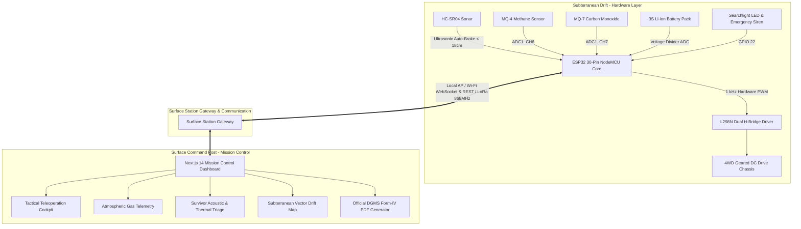

<div align="center">


# 🛡️ PROJECT RAKSHAK-MINE
### Autonomous Robotic Search, Rescue & Underground Mine Safety Monitoring System
**Smart India Hackathon (SIH 2026) | Problem Statement: AI Hazard Detection & Robotics in Underground Mines**

[](https://github.com/Richardfeynman-21/SIX_Wonders)
[](https://nextjs.org/)
[](https://www.espressif.com/)
[](https://www.dgms.gov.in/)
[](https://www.typescriptlang.org/)
[](https://tailwindcss.com/)

<p align="center">
  <em>"Protection, Detection, and Rescue for Safer Mines and Stronger Lives."</em>
</p>

[Mission Overview](#-mission-overview) •
[System Architecture](#-system-architecture) •
[Repository Structure](#-repository-structure) •
[Hardware & Wiring](#-hardware-wiring--pin-allocations) •
[ESP32 Firmware](#-esp32-rover-firmware) •
[Frontend Dashboard](#-nextjs-mission-control-dashboard) •
[Getting Started](#-getting-started) •
[DGMS Compliance](#-statutory-dgms-cmr-2017-compliance)

---
</div>

## 📌 Mission Overview

Underground coal mines in the Jharkhand coalfield belt (Jharia, Raniganj, Dhanbad, Bokaro) are among the most hazardous environments in the world. Miners face extreme subterranean perils:
1. **Inflammable & Toxic Gases**: Sudden outbursts of methane ($CH_4$ / firedamp) and deadly carbon monoxide ($CO$ / afterdamp) following spontaneous seam combustion.
2. **Strata Geotechnical Instability**: Roof falls, sidewall collapses, and coal bursts.
3. **Severe Inundation & Aquifer Breaches**: Rapid water accumulation sealing off drift escape routes.
4. **Zero-Visibility Darkness & Airborne Particulate**: Dense coal dust and smoke rendering optical navigation impossible.
5. **Trapped Survivor Localization**: Inability of surface command stations to pinpoint or communicate with survivors through collapsed galleries without risking rescue personnel.

**RAKSHAK-MINE** is an intelligent, low-cost autonomous rescue rover coupled with a mission control surface dashboard designed by **Team SIX Wonders**. It enables surface operators to remotely explore dangerous drifts, gauge atmospheric toxins, detect acoustic taps and thermal signatures of trapped survivors, map subterranean obstacles in real-time, and coordinate rescue efforts with zero human risk.

---

## 🏗️ System Architecture



---

## 📁 Repository Structure

Both the Next.js 14 Mission Control Frontend and the ESP32 Rover Firmware are unified within this repository:

```
SIX_Wonders/
├── docs/                                  # Project assets and team emblems
│   └── logo.jpg                           # Official Team SIX Wonders emblem
│
├── esp32_rover_firmware/                  # Complete ESP32 Rover Firmware
│   ├── esp32_rover_firmware.ino           # Main C++ firmware (motor PWM, sensors, failsafes)
│   ├── dashboard_html.h                   # Embedded standalone HTML5/WebSocket tactical HUD
│   ├── logo.jpg                           # Embedded logo asset for standalone webserver
│   ├── logo_base64.txt                    # Base64 pre-encoded string of rover emblem
│   └── README.md                          # Firmware flashing & hardware calibration guide
│
├── frontend/                              # Next.js 14 Surface Mission Control Dashboard
│   ├── public/                            # Static assets (rover photos, maps, icons)
│   │   ├── assets/
│   │   │   ├── camera_feed.jpg            # Optical inspection feed asset
│   │   │   ├── mine_map.jpg               # Sector 4B drift blueprint
│   │   │   ├── rover.png                  # High-DPI transparent rover render
│   │   │   └── sidebar_footer.jpg         # Sidebar banner graphic
│   │   ├── favicon.ico
│   │   ├── icon.svg
│   │   └── logo.svg
│   ├── src/
│   │   ├── app/
│   │   │   ├── globals.css                # Custom glassmorphism, scrollbars, and MG classes
│   │   │   ├── layout.tsx                 # Root HTML layout and metadata
│   │   │   └── page.tsx                   # Central Dashboard with Breadcrumb Subsystems
│   │   ├── components/
│   │   │   ├── GasMonitoringGauges.tsx    # DGMS CMR 2017 gas concentration dials
│   │   │   ├── HazardAndTriage.tsx        # YOLOv8 Geotechnical & survivor triage cards
│   │   │   ├── Header.tsx                 # Online telemetry badges, E-Stop & Bell popover
│   │   │   ├── LiveCameraFeed.tsx         # Optical / thermal viewport with snapshot & teleop
│   │   │   ├── LogsProtocolsReportRow.tsx # Event logs, CMR 2017 protocols & PDF export
│   │   │   ├── MineMapCard.tsx            # Interactive spatial map with waypoint inspection
│   │   │   ├── PowerMonitoringCard.tsx    # 3S Li-ion discharge curve & BMS telemetry
│   │   │   ├── RoverControlModal.tsx      # Tactical teleoperation cockpit with PWM slider
│   │   │   ├── Sidebar.tsx                # 14-item navigation drawer with badge alerts
│   │   │   ├── StatusCardsRow.tsx         # Rover status, battery gauge, connection indicators
│   │   │   ├── SubsystemViews.tsx         # Fullscreen views for all 14 subsystem routes
│   │   │   ├── SurvivorAudioWaveform.tsx  # Web Audio API 320Hz acoustic tapping analyzer
│   │   │   └── TwoWayCommunication.tsx    # Surface-to-rover PTT voice & LoRa intercom
│   │   ├── lib/
│   │   │   ├── api.ts                     # REST client, WebSocket engine & mock data
│   │   │   └── utils.ts                   # Formatting, CSS merging & styling helpers
│   │   └── types/
│   │       ├── rover.ts                   # Hardware & teleoperation TypeScript contracts
│   │       └── telemetry.ts               # Sensor telemetry, alerts & command interfaces
│   ├── package.json                       # Next.js 14, React 18, Lucide React, Tailwind
│   ├── tailwind.config.js                 # Theme colors, borders, custom animations
│   ├── tsconfig.json                      # Strict TypeScript compilation options
│   └── README.md                          # Frontend setup, configuration & architecture
│
├── backend/                               # FastAPI Mission Control Service (Optional Local Server)
│   ├── main.py                            # Telemetry ingestion, WebSockets & command routing
│   ├── database.py                        # SQLite circular FIFO logging
│   ├── dgms_standards.py                  # DGMS compliance threshold calculations
│   ├── models.py                          # Pydantic data schemas
│   ├── pdf_exporter.py                    # ReportLab Form-IV incident dossier generator
│   └── requirements.txt                   # Python dependencies
│
├── .gitignore                             # Clean filtering for Node, Python & binaries
└── README.md                              # Master project briefing dossier (this file)
```

---

## ⚡ Hardware Wiring & Pin Allocations

The rover uses an **ESP32 30-Pin NodeMCU** microcontroller. All pin allocations and circuit specifications are strictly mapped in [`esp32_rover_firmware/esp32_rover_firmware.ino`](esp32_rover_firmware/esp32_rover_firmware.ino):

| Subsystem | Component | ESP32 Pin | Function / Logic | Hardware Notes |
| :--- | :--- | :--- | :--- | :--- |
| **Motor Drive** | L298N ENA | **GPIO 32** | Right Motors PWM | Jumper removed; 1 kHz PWM frequency |
| **Motor Drive** | L298N IN1 | **GPIO 27** | Right Direction 1 | Standard logic level |
| **Motor Drive** | L298N IN2 | **GPIO 14** | Right Direction 2 | Standard logic level |
| **Motor Drive** | L298N IN3 | **GPIO 25** | Left Direction 1 | Standard logic level |
| **Motor Drive** | L298N IN4 | **GPIO 26** | Left Direction 2 | Standard logic level |
| **Motor Drive** | L298N ENB | **GPIO 33** | Left Motors PWM | Jumper removed; 1 kHz PWM frequency |
| **Sonar Distance**| HC-SR04 TRIG | **GPIO 5** | Sonar Trigger Pulse | 10µs trigger pulse |
| **Sonar Distance**| HC-SR04 ECHO | **GPIO 4** | Sonar Echo Pulse | **Requires 5V to 3.3V divider (1kΩ / 2kΩ)** |
| **Gas Sensing** | MQ-4 (CH4) | **GPIO 34** | Analog Methane Level | ADC1_CH6 (Input-only pin) |
| **Gas Sensing** | MQ-7 (CO) | **GPIO 35** | Analog Carbon Monoxide | ADC1_CH7 (Input-only pin) |
| **Safety Warning**| High-Decibel Siren| **GPIO 22** | Strobe & Acoustic Buzzer | Active High output |
| **Power Telemetry**| 3S Li-ion Battery | **GPIO 36 (VP)** | Resistor Divider Voltage | Scaled 0.00392 ADC factor |

> [!WARNING]
> **HC-SR04 Echo Pin Safety**: The HC-SR04 echo pin outputs a 5V logic signal. Never connect it directly to ESP32 GPIO 4 without a voltage divider (1kΩ in series and 2kΩ to ground) to protect the 3.3V ESP32 inputs.

---

## 🤖 ESP32 Rover Firmware

The firmware located in [`esp32_rover_firmware/`](esp32_rover_firmware/) provides autonomous failsafes and real-time teleoperation capabilities:

* **Dual-Bridge L298N Propulsion**: 1 kHz hardware PWM driving 4 geared motors with smooth speed ramp control (100–255 PWM).
* **180° Physical Chassis Inversion**: Inverted chassis logic handles sonar and gas sensor orientation with a software-controllable `reverseOrientation` flag.
* **Ultrasonic Auto-Brake Failsafe (DGMS CMR 173)**: If an obstacle is detected closer than **18 cm**, propulsion is instantaneously halted, overriding manual commands to prevent collisions.
* **Embedded Standalone Web HUD**: Includes [`dashboard_html.h`](esp32_rover_firmware/dashboard_html.h), an embedded single-file dashboard served directly by the ESP32 on port `80` over Wi-Fi AP (`RAKSHAK-ROVER-AP` / `mineguard123`) when surface station networks are out of range.
* **Telemetry REST API**:
  - `GET /api/status`: Outputs JSON payload containing gas readings, distance, motor state, and battery voltage.
  - `POST /api/command`: Accepts JSON payload `{"command": "FORWARD", "speed": 220}` to control locomotion.

---

## 💻 Next.js Mission Control Dashboard

The frontend application located in [`frontend/`](frontend/) is built with **Next.js 14 (App Router)**, **TypeScript**, and **Tailwind CSS**. It provides a real-time command station:

1. **Mission Control Header**:
   - Live connectivity badges: ESP32 Core Online & LoRa Sub-GHz Link Status.
   - Real-time UTC clock.
   - Interactive Active Incident Alerts drawer with one-click routing.
   - Hardware Emergency Stop (`E-STOP`) disengaging all propulsion within 20ms.
2. **Tactical Teleoperation Cockpit Modal (`RoverControlModal.tsx`)**:
   - Dynamic PWM speed slider (100–255 PWM) with real-time percentage indicators.
   - 3x3 directional keypad + full keyboard support (`W`, `A`, `S`, `D`, Arrows, Space to STOP).
   - Searchlight toggle and emergency siren beacon.
   - Throttled key-repeat prevention ensuring reliable command dispatch.
3. **Subsystem Navigation & Global Breadcrumbs**:
   - Sidebar with 14 specialized subsystem routes.
   - Persistent `← Back to Dashboard` navigation bar with contextual breadcrumbs so operators never get lost in a view.
4. **Atmospheric Gas Gauges (`GasMonitoringGauges.tsx`)**:
   - Dynamic gauge dials for $CH_4$, $CO$, $CO_2$, $O_2$, and $H_2S$.
   - Strict color-coded DGMS CMR 2017 thresholds (Green: Safe, Amber: Warning, Red: Danger).
5. **Acoustic Survivor Waveform (`SurvivorAudioWaveform.tsx`)**:
   - 24-band frequency visualizer tuned to human voice formants (320 Hz) and rhythmic tapping sequences.
   - Web Audio API synthesizer with automatic suspended-state resumption.
6. **Subterranean Spatial Map (`MineMapCard.tsx`)**:
   - Vector blueprint of Incline Drift 4B with dynamic zoom (0.75x – 2.5x).
   - Layer toggles for route path, rockfall hazard zones, checkpoints, and obstacle distances.
7. **Statutory Incident Dossier Generator (`LogsProtocolsReportRow.tsx`)**:
   - Generates official DGMS Form-IV compliant Incident Briefing Reports with complete gas trends and telemetry logs.

---

## 🚀 Getting Started

### 1. ESP32 Firmware Flashing

1. Open **Arduino IDE** (or **VS Code with PlatformIO**).
2. Install the **ESP32 Board Package** (`Tools > Board > Boards Manager > ESP32 by Espressif`).
3. Open [`esp32_rover_firmware/esp32_rover_firmware.ino`](esp32_rover_firmware/esp32_rover_firmware.ino).
4. Configure your board settings:
   - **Board**: `ESP32 Dev Module`
   - **Upload Speed**: `921600`
   - **CPU Frequency**: `240MHz (WiFi/BT)`
   - **Flash Frequency**: `80MHz`
   - **Partition Scheme**: `Default 4MB with spiffs (1.2MB APP/1.5MB SPIFFS)`
5. Connect your ESP32 via micro-USB and click **Upload**.
6. Connect to the rover's Wi-Fi network:
   - **SSID**: `RAKSHAK-ROVER-AP`
   - **Password**: `mineguard123`
   - Access the standalone rover HUD at `http://192.168.4.1`

### 2. Next.js Frontend Dashboard Setup

#### Prerequisites
- **Node.js**: v18.17.0 or higher
- **npm**: v9.0.0 or higher

#### Installation
```bash
# Navigate to the frontend directory
cd frontend

# Install dependencies
npm install

# Start development server
npm run dev
```

Open your browser and navigate to:
```
http://localhost:3000
```

#### Production Build Verification
```bash
# Create optimized production build
npm run build

# Start production server
npm run start
```

---

## 📜 Statutory DGMS CMR 2017 Compliance

RAKSHAK-MINE is engineered in compliance with the **Coal Mines Regulations (CMR) 2017** issued by the **Directorate General of Mines Safety (DGMS)**, Ministry of Labour and Employment, Government of India:

* **Regulation 169 (Inflammable & Noxious Gases)**: Continuous monitoring of methane ($CH_4 < 0.75\%$ general body limit; electric power cut-off at $1.25\%$) and carbon monoxide ($CO < 50 \text{ ppm}$).
* **Regulation 170 (Electric Apparatus in Gassy Seams)**: Low-voltage intrinsically safe logic circuits rated for Degree III gassy coal seams.
* **Regulation 173 (Autonomous Propulsion Interlocks)**: Automatic propulsion cutoff upon sensing an obstacle or strata disruption within 18 cm.

---

## 👥 Team SIX Wonders

* **Lead Developer & System Architect**: [Rishikeshwar Reddy](https://github.com/Richardfeynman-21)
* **Team**: SIX Wonders
* **Repository**: [https://github.com/Richardfeynman-21/SIX_Wonders.git](https://github.com/Richardfeynman-21/SIX_Wonders.git)
* **Hackathon**: Smart India Hackathon (SIH 2026)

---

<div align="center">
  <sub>Built with pride for Indian Miners by Team SIX Wonders. All rights reserved.</sub>
</div>
